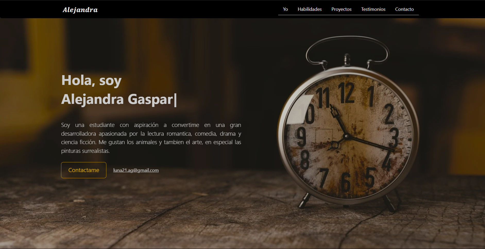
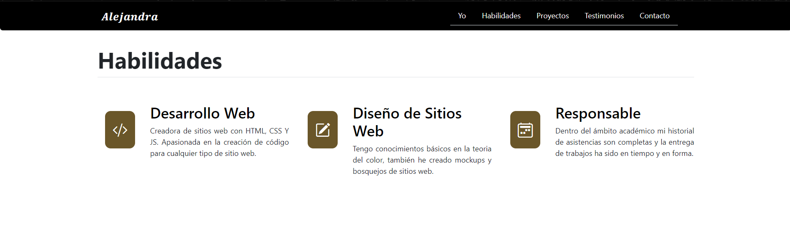
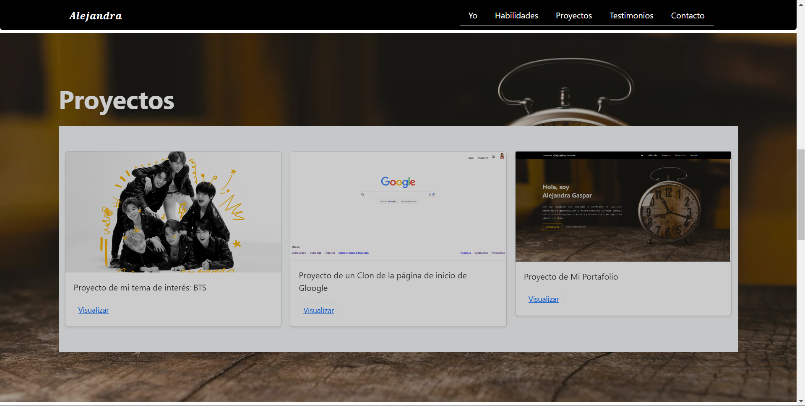
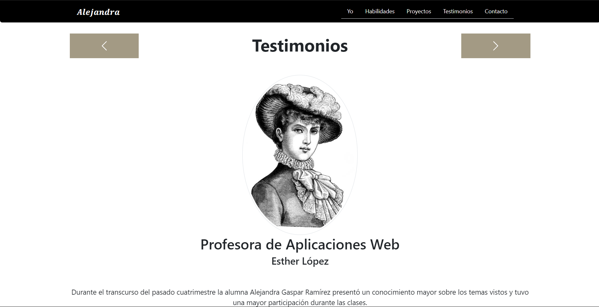
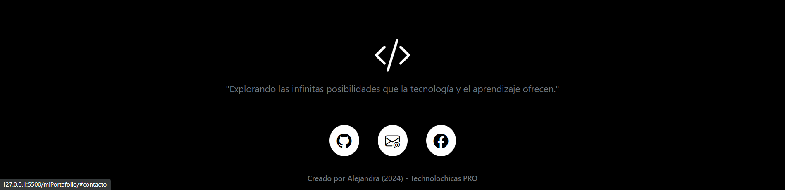

# Mi portafolio de Technolochicas PRO

Este portafolio es desarrollado para poner en práctica las habilidades obtenidas dentro del bootcamp de desarrollo frontend.

Fue desarrollado con HTML, CSS y JS con el uso del framework Bootstrap utilizando animaciones de bibliotecas extrernas.

[Proyecto en Línea](https://glistening-rabanadas-f97f0d.netlify.app/)

- Capturas de pantalla

## Tecnologías
* HTML
* CSS
* Javascript
* Bootstrap 5

Ocupamos bibliotecas extra.

Creado por Alejandra Gaspar en el bootcamp de Technolochicas PRO.